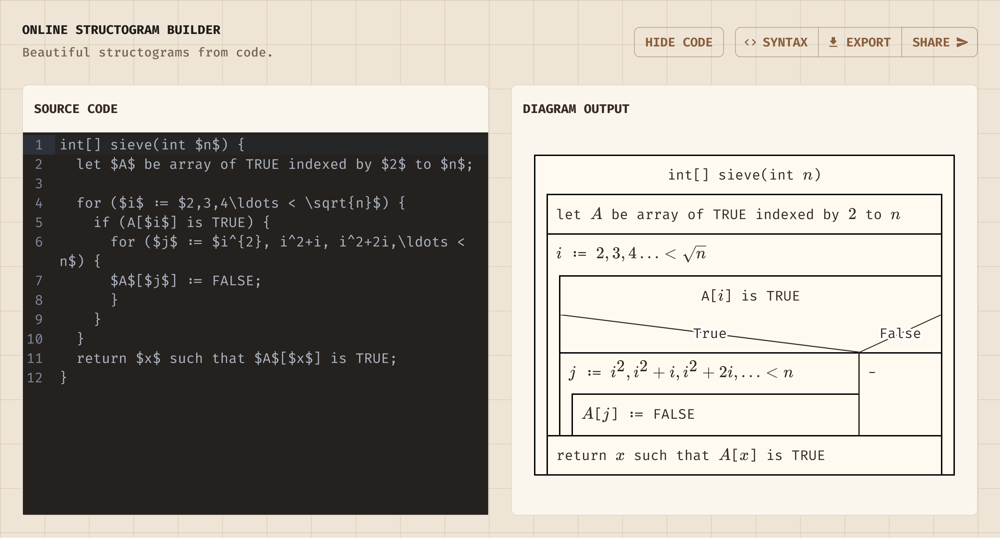

> Have you heard of [MermaidJS](https://mermaid.js.org/)? This project is inspired by it!

# ~Aventurine | Build Clean Structograms from Code

_Aventurine_ lets you build, export, and share beautiful structograms from C-style source code. The syntax is flexible enough to display ordinary prose, pseudocode, or code-like statements, and it supports inline LaTeX inside process text.

## ~Syntax

Most input is arbitrary. Outside recognized syntax blocks, everything before a terminating semicolon is displayed as process text.

Only `if` / `else`, `for`, `while`, `do` / `while`, declarations followed by brace-delimited bodies, and balanced parentheses or braces are parsed structurally. Inline LaTeX is supported between single dollar signs.

`//` starts a comment, so the remaining text on that line is ignored.

### ~Process

Any free-form text becomes a process when it ends with a semicolon.

**Pattern**

```text
#;
```

**Examples**

```text
total = price * quantity;
```

```text
Send invoice to customer;
```

### ~If / else

Conditions and process text are free-form. The `else` branch is optional.

**Pattern**

```text
if (#) {
  #;
} else {
  #;
}
```

**Examples**

```text
if (score >= 50) {
  result = pass;
} else {
  result = retry;
}
```

```text
if (order is paid) {
  Prepare shipment;
} else {
  Request payment;
}
```

### ~For loop

The parser preserves any loop expression placed between the parentheses.

**Pattern**

```text
for (#) {
  #;
}
```

**Examples**

```text
for (i = 0; i < 5; i = i + 1) {
  total = total + i;
}
```

```text
for (each item) {
  Add item to total;
}
```

### ~While loop

The condition is checked before the body and may contain free-form text.

**Pattern**

```text
while (#) {
  #;
}
```

**Examples**

```text
while (items > 0) {
  items = items - 1;
}
```

```text
while (queue has items) {
  Process next item;
}
```

### ~Do / while loop

The body runs before the condition. A trailing semicolon is required.

**Pattern**

```text
do {
  #;
} while (#);
```

**Examples**

```text
do {
  items = items - 1;
} while (items > 0);
```

```text
do {
  Ask for confirmation;
} while (answer is missing);
```

### ~Function

Any declaration followed by a brace-delimited body is treated as a function.

**Pattern**

```text
# #(#) {
  #;
}
```

**Examples**

```text
int add(int x, int y) {
  result = x + y;
}
```

```text
workflow prepare(order) {
  Validate order;
  Pack order;
}
```

### ~Inline LaTeX

Dollar-delimited LaTeX can appear anywhere inside free-form process text.

**Pattern**

```text
# = $...$;
```

**Examples**

```text
formula = $x^2 + y^2$;
```

```text
sequence = $a_1 + a_2 + a_3$;
```
